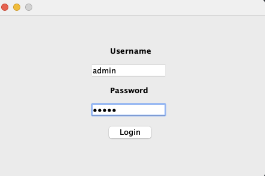
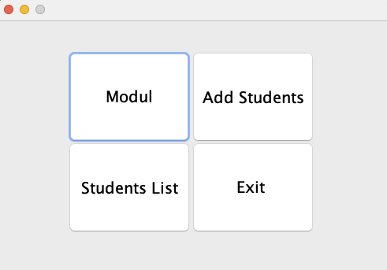
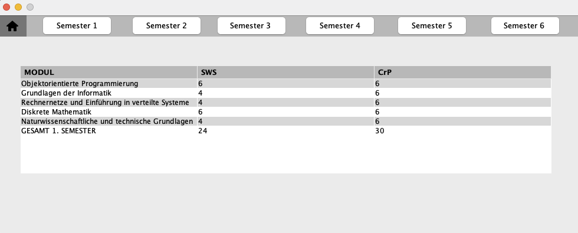
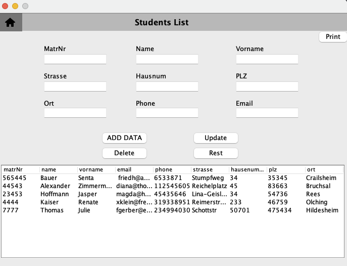
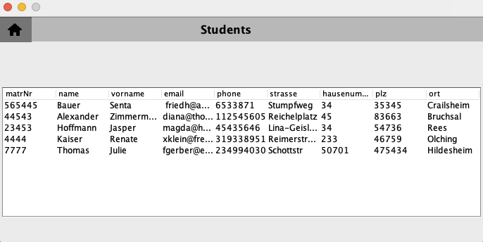
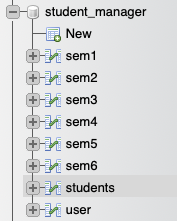

# Student Management Project 

This project was built with Java and Swing and was connected to a localhost DatenBank.


**The following classes are included in the project:**
* MainFenster
* LoginForm
* MainPage
* ModulenList
* studentsPage 
* AllStudentsLis 
* DbCon

****
On the login screen, enter the username admin and the password admin.



****
This page provides access to additional pages and also allows us to leave the application.



****
This page displays many tables, and these six tables are stored in the database system.



****
This page is for adding new students, and each student who is added to the list is saved in the database system.



****
The last page displays every student on the List.



****

# DATEN BANK SYSTEM

In this project, I created my database using phpmyadmin.



**I named my database student_manger and set up eight different tables.**

* **students:** This table displayed on the studentsPage and AllStudentsLis pages.

```sql
CREATE TABLE students (
                            id int NOT NULL,
                            matrNr int,
                            name varchar,
                            vorname varchar,
                            email varchar,
                            phone int,
                            strasse varchar,
                            hausenummer int,
                            plz int,
                            ort int,
                            PRIMARY KEY (id)
                            
);
```
| id  | matrNr | name | vorname|email|phone|strasse|hausenummer|plz|ort|
|-----|----|------|----------|-----|----|----|-----|----|----|
| 1   | 565445 | Bauer|Senta| friedh@ackermann.de|6533871|Stumpfweg|34|35345|Crailsheim|
****
* **user:** The user table may also be added to the login class to determine if the user name and password are valid.

```sql
CREATE TABLE user (
                            id int NOT NULL,
                            name varchar,
                            password varchar,
                            PRIMARY KEY (id)
                            
);
```
| id  | name  | password |
|-----|-------|----------|
| 1   | admin | admin    |


****
* **sem1-6:** Tables 1 through 6 are identical but have different values.

```sql
CREATE TABLE sem1 (
                            id int NOT NULL,
                            MODUL varchar,
                            SWS int,
                            CrP int,
                            PRIMARY KEY (id)
                            
);
```

| id  |MODUL| SWS |CrP|
|-----|-----|---|-------|
| 1   |Objektorientierte Programmierung| 6 |6|

****

**To link your datenBank System, do the following.**

* String url = "jdbc:mysql://hostname:port/database";
* String username = "root";
* String password = "";

Then, add the SQL jar file.

# ToDo 
* fix update Button.
* fix Print Button.


